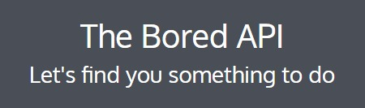
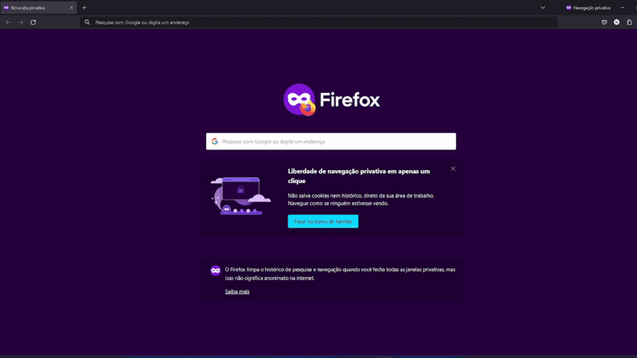
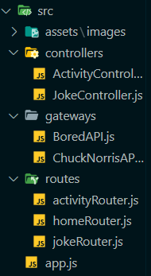
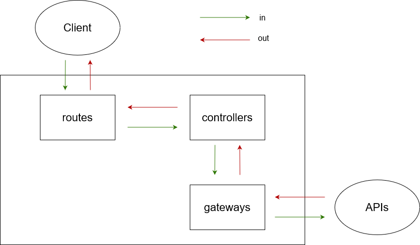
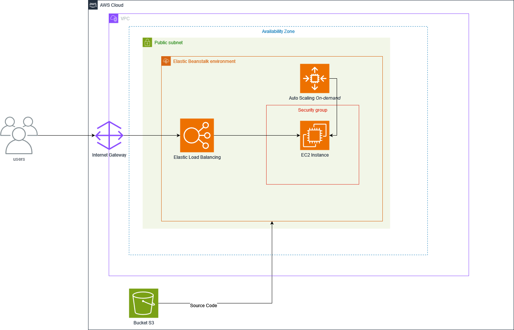

# 🚀 Projeto - API

Este projeto consiste em uma nova API onde a partir do tratamento dos dados de duas APIs públicas, uma de piadas que somente o CHUCK NORRIS é capaz de fazer e a outra API de atividades para se fazer quando se estiver no tédio, é expresso as informações em duas rotas distintas. Foi utilizado do Node.js e Express na criação da API, utilizado para o deploy o serviço da AWS ELASTIC BEANSTALK.

Projeto destinado para a avaliação da quarta sprint do programa de bolsas Compass UOL para formação em machine learning para AWS.

***

## 🖳 Desenvolvimento

O projeto foi desenvolvido com Node.js para implementação da API e express para criação das rotas HTTP. A partir das APIs públicas CHUCKNORRIS.IO e THE BORED API foi feito a coleta dos dados expressos no site. Após a criação da API, com o projeto em um .zip foi feito o deploy na plataforma da AWS com o serviço do Elastic Beanstalk e assim utilizar a nova api de maneira pública.

***

## ✨ APIs utilizadas
<div align="center">
  <a style = "text-decoration: none; color: #1C1C1C;" href="https://api.chucknorris.io/"></a>
  <a style = "text-decoration: none; color: #1C1C1C;" href="https://www.boredapi.com/"></a>
</div>

***

## 🎮 Aplicação
<div align= "center">
  
</div>

***

##  🛠️ Como Utilizar

### Em caso do serviço estar ativo:

Acesse: 
```
http://equipe2app.us-east-1.elasticbeanstalk.com/
```
#### Acesso das rotas

Para rota de piadas:
```
http://equipe2app.us-east-1.elasticbeanstalk.com/api/piadas
```

Para rota de atividades:
```
http://equipe2app.us-east-1.elasticbeanstalk.com/api/atividades
```

### Em caso de rodar localmente:
1. Clone esse repositório em sua máquina local
2. Instale as bibliotecas necessárias com `npm install`
3. Copie o conteúdo de `.env.example` para um arquio `.env`
4. Execute `npm run start`
5. A api estará rodando em `localhost:8080/`

***

## 🔧 Tecnologias

<div style="display: inline_block"><br>
  <a href="https://developer.mozilla.org/en-US/docs/Web/JavaScript"></a>
  <a href="https://nodejs.org/docs/latest/api/"></a>
  <a href="https://expressjs.com/pt-br/"></a>
  <a href="https://aws.amazon.com/pt/"></a>
</div>

<br>

- JS: ES6
- Node.js: v20.11.0
- Express: v4.18.3

***

## 🧱 Estrutura
- ### Diretórios:
<div align= "center">
  
</div>

- ### Projeto:

<div align= "center">
  
</div>


- `src/app.js`: O arquivo onde o servidor Express é configurado.
- `src/gateway`: Diretórios para os arquivos onde ocorrem a comunicação com as APIs.
- `src/controllers`: Diretório para o controle dos dados formatados e serem encaminhados para as rotas.
- `src/routes`: Diretório onde ficam localizado as rotas que executarm as requisições HTTP.

***

## ☁️ Arquitetura Cloud

<div align= "center">
  
</div>

***

## 🛑 Dificuldades conhecidas

- `Deploy na Elastic Beanstalk`: Devido ser um serviço que não tinhamos visto anteriormente ocorreu algumas dúvidas durante a criação que ao ser analisada na documentação, foram sanadas e assim sendo possível o deploy ocorrer normalmente.

***

## 👨‍💻 Desenvolvedores

- <a href="https://github.com/NatthanElias">Natthan Elias</a>
- <a href="https://github.com/Pablosxz">Pablo Lucas</a>
- <a href="https://github.com/ratelp">Rafael Martinho</a>
- <a href="https://github.com/YeffersonSilva">Yefferson Silva</a>
